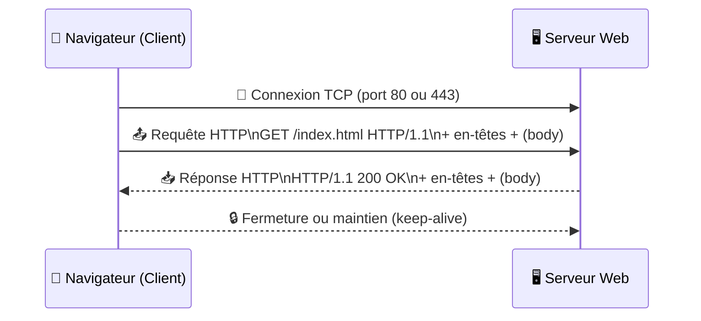
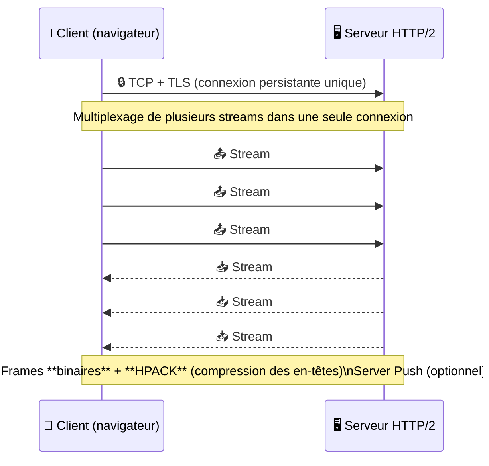
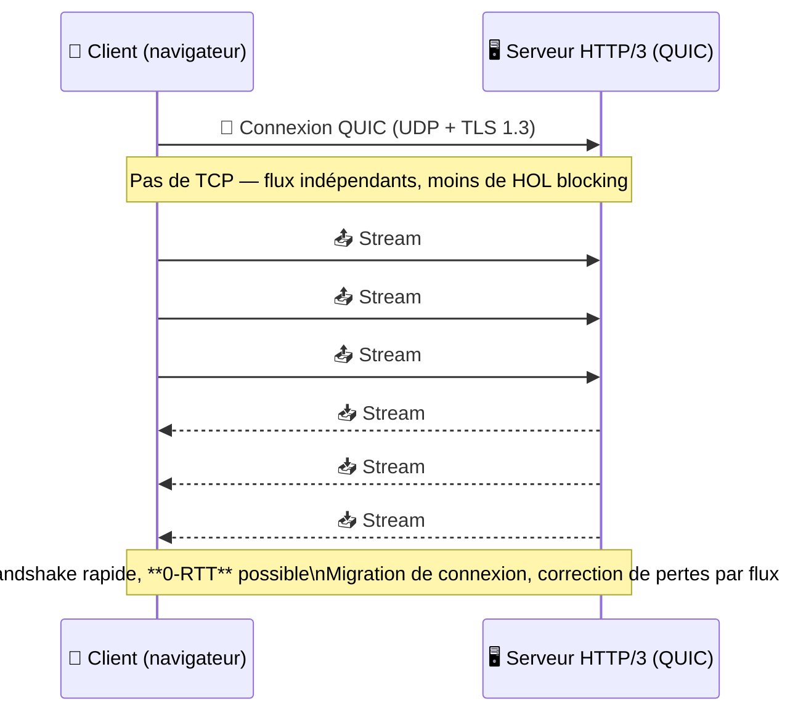

# Architecture des Applications Web  
## Partie II — Le protocole HTTP en profondeur  
**Master Informatique**

---

## Objectifs de la partie

- Comprendre la structure des **messages HTTP** (requête/réponse).  
- Maîtriser **méthodes**, **statuts** et **en-têtes** clés.  
- Savoir configurer **cache**, **négociation de contenu**, **CORS**.  
- Situer **HTTP/1.1**, **HTTP/2** et **HTTP/3 (QUIC)**.  
- Pratiquer avec **curl** et les **DevTools** du navigateur.  

---

## Modèle de communication

- **Client → Serveur** via TCP (HTTP/1.1, HTTP/2) ou QUIC (HTTP/3).  
- **Stateless** : chaque requête porte le contexte nécessaire.  
- Ressource identifiée par une **URI** (schéma, host, path, query, fragment).  

---

## Message HTTP — Requête

```
GET /api/users?limit=10 HTTP/1.1
Host: example.com
Accept: application/json
User-Agent: curl/8.0
```

- **Ligne de requête** : `Méthode SP URI SP Version`.  
- **En-têtes** : `Nom: Valeur`.  
- **Corps** : optionnel (POST, PUT, PATCH).  

---

## Message HTTP — Réponse

```
HTTP/1.1 200 OK
Content-Type: application/json
Cache-Control: max-age=60
ETag: "a1b2c3"

{"items":[...]}
```

- **Ligne d’état** : `Version SP Code SP Raison`.  
- **En-têtes** : métadonnées de la ressource.  
- **Corps** : représentation (HTML, JSON, binaire…).  

---

## Méthodes HTTP

- **GET** — lecture (sûre, idempotente).  
- **HEAD** — métadonnées sans corps.  
- **POST** — création / traitement non idempotent.  
- **PUT** — remplacement total (idempotente).  
- **PATCH** — modification partielle.  
- **DELETE** — suppression (idempotente).  
- **OPTIONS** — capacités, prévol CORS.  

---

## Codes de statut

| Famille | Exemples | Signification |
|----------|-----------|----------------|
| 2xx | 200 OK, 201 Created, 204 No Content | Succès |
| 3xx | 301 Moved Permanently, 304 Not Modified | Redirection / cache |
| 4xx | 400 Bad Request, 401 Unauthorized, 404 Not Found | Erreurs client |
| 5xx | 500 Internal Server Error, 503 Service Unavailable | Erreurs serveur |

---

## En-têtes essentiels (1/2)

- **Content-Type**, **Content-Length**, **Content-Encoding**  
- **Accept**, **Accept-Language**, **Accept-Encoding**  
- **Authorization**, **WWW-Authenticate**  
- **User-Agent**, **Referer**, **Origin**

---

## En-têtes essentiels (2/2)

- **Cache-Control** (`no-store`, `max-age`, `s-maxage`)  
- **ETag** / **If-None-Match**  
- **Last-Modified** / **If-Modified-Since**  
- **Vary** (`Accept`, `Origin`, etc.)  
- **Location** (redirections, 201 Created)

---

## Négociation de contenu

- Le serveur choisit la représentation selon `Accept`, `Accept-Language`, etc.  
- Réponse `200 OK` (représentation choisie) ou `406 Not Acceptable`.  
- Bonnes pratiques : toujours fournir une **valeur par défaut**.  

---

## Caching HTTP — Bases

- **Cache-Control** : `max-age`, `public`, `private`, `no-store`.  
- **Validation** : `ETag` + `If-None-Match` → `304 Not Modified`.  
- **Heuristique** : si pas d’expiration, via `Last-Modified`.  
- **CDN** : directives `s-maxage`, `stale-while-revalidate`, `stale-if-error`.  

---

## Caching — Exemple

```
Cache-Control: public, max-age=300, stale-while-revalidate=30
ETag: "v42"
```

→ Le client peut réutiliser la ressource pendant 5 min,  
puis la **revalider** avec le serveur.  
En cas d’erreur, le cache peut servir une version **stale**.  

---

## Conditionnels et concurrence

- **Préconditions** : `If-Match`, `If-Unmodified-Since`.  
- Évitent les écrasements concurrents.  
- Réponse : **412 Precondition Failed** si conflit.  
- Pattern courant : lecture `ETag` → écriture avec `If-Match`.  

---

## Sécurité du transport — HTTPS / TLS

- **HTTPS = HTTP + TLS** : confidentialité, intégrité, authenticité.  
- **HSTS** (`Strict-Transport-Security`) pour forcer HTTPS.  
- Certificats, chaînes de confiance, renouvellement (ACME / Let’s Encrypt).  

---

## Cookies, sessions, tokens

- `Set-Cookie` : options `Secure`, `HttpOnly`, `SameSite` (Lax / Strict / None).  
- Sessions côté serveur : ID stocké en cookie.  
- **JWT** portés côté client (`Authorization: Bearer ...`).  
  ⚠️ Attention à la **révocation** et à la **durée de vie**.  

---

## CORS — Cross-Origin Resource Sharing

- Définit qui peut appeler une ressource depuis un autre domaine.  
- **Simple request** ou **preflight (OPTIONS)**.  
- Réponses serveur :  
  - `Access-Control-Allow-Origin`  
  - `Access-Control-Allow-Methods`  
  - `Access-Control-Allow-Headers`  
  - `Access-Control-Allow-Credentials`

---

## HTTP/1.1 vs HTTP/2 vs HTTP/3

| Version | Transport | Caractéristiques clés |
|----------|------------|------------------------|
| HTTP/1.1 | TCP | Keep-alive, 1 flux / connexion |
| HTTP/2 | TCP | Multiplexage, HPACK, binaire |
| HTTP/3 | QUIC (UDP) | TLS intégré, démarrage rapide, résilient |

→ Gains majeurs en **latence** et **performances mobiles**.  

---

## HTTP/1.x — fonctionnement général (séquentiel)


**Caractéristiques :**
- 1 requête → 1 réponse, pas de multiplexage.  
- En-têtes en **texte brut**, pipeline limité (HOL blocking).  
- `Connection: keep-alive` pour réutiliser la connexion.  

---

## HTTP/2 — connexion unique multiplexée


**Caractéristiques :**
- Un seul TCP, **multiplexage** de flux parallèles.  
- **Frames binaires**, **HPACK** pour les en-têtes.  
- Réduit le HOL au niveau HTTP mais **reste** sensible au HOL de **TCP**.  

---

## HTTP/3 — QUIC (UDP) & 0‑RTT


**Caractéristiques :**
- Basé sur **QUIC/UDP** : multiplexage **sans** HOL TCP.  
- **TLS 1.3** intégré, reprise **0‑RTT**.  
- Meilleures perfs en mobilité et réseaux instables.  

---

## Observabilité et limitation de taux

- Corrélation des requêtes via **Trace-ID**.  
- Codes **429 Too Many Requests**, en-tête `Retry-After`.  
- Idempotence côté client → retries sûrs.  

---

## Outils — curl

```bash
# Requête GET
curl -i -H "Accept: application/json" https://httpbin.org/get

# POST JSON
curl -i -X POST -H "Content-Type: application/json"      -d '{"title":"Hello"}' https://httpbin.org/post

# Test CORS (prévol)
curl -i -X OPTIONS   -H "Origin: https://example.org"   -H "Access-Control-Request-Method: POST"   https://api.example.com/resource
```

---

## Outils — DevTools navigateur

- Onglet **Network** : en-têtes, timings, cache.  
- Option **Disable cache** pour tester les politiques.  
- **Throttling** : simuler 3G / 4G, latence réseau.  

---

## Bonnes pratiques HTTP

- Définir des **contrats d’API** clairs (types, statuts, erreurs).  
- Utiliser **ETag** et **Cache-Control** pour réduire la latence.  
- Sécuriser **TLS** et **cookies** (`Secure`, `HttpOnly`, `SameSite`).  
- Mettre en place **CORS** explicitement.  
- Observer : logs structurés, corrélation, métriques.  

---

## Partie suivante

### Partie III — Les standards du Web
- Comprendre le rôle fondamental de HTML, CSS et JavaScript dans le Web.
- Manipuler la structure du DOM et les interactions client.
- Identifier le cycle de vie d’une page web.
- Poser les bases du développement front-end moderne.
